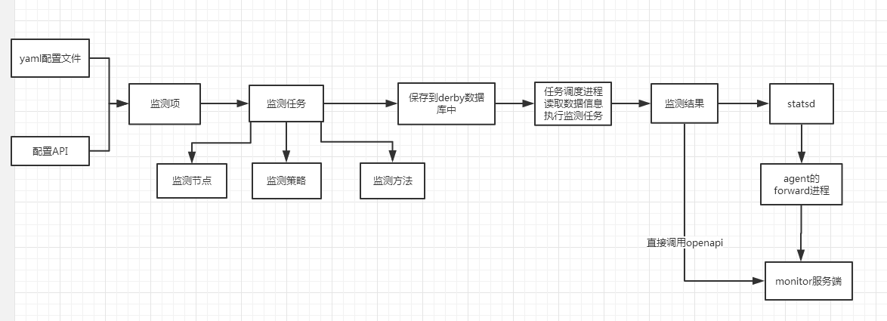
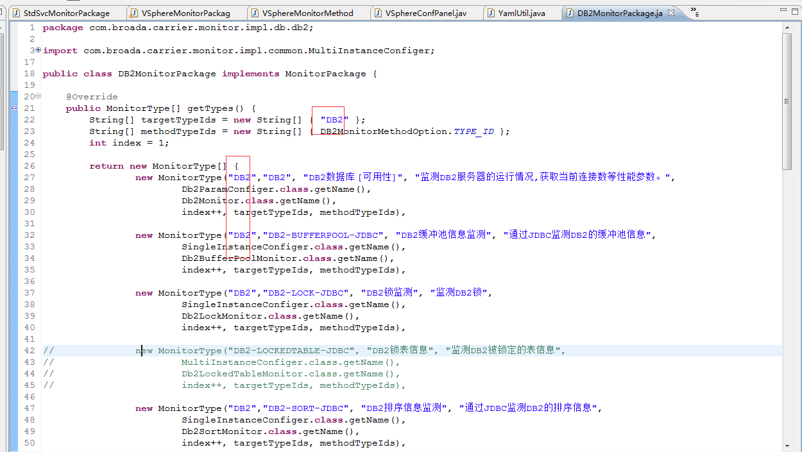
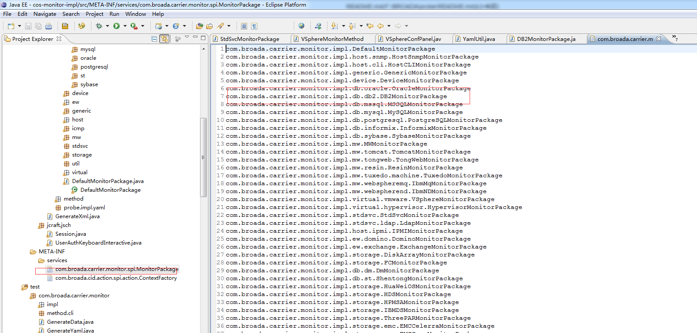
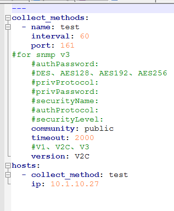

##  构建
在monitor/probe执行ant msi 构建，会同时打包linux和windows版本       

## 流程     
1.probe读取配置文件或者读取配置API，获取监测任务以及执行周期      
2.加载配置文件中的任务到derby数据库。      
3.调度进程读取derby数据库任务信息，执行采集任务         
4.监测结果与monitor Server端指标名称的映射     
5.上报到dd-agent的statsd接口或者直接上报到Server端      

   

##  监测开发     
### 概况    
1. 目前已经集成并测试通过Oracle、DB2、Weblogic、Snmp、Linux、AIX、UNIX、Windows、Snmp、Mysql、Websphere、IBM-MQ、Tomcat、SQLServer、Apache、JBOSS        
2. 未集成的有:HTTP服务可用性、FTP服务可用性、DNS服务可用性、HTTPS服务可用性、SMTP服务可用性、POP服务可用性、TCP服务可用性        
3. 已集成待验证的：Tongweb、达梦、神通、Exchange、Domino、Resin、Postgresql、IIS、LDAP等      

### 开发流程      
由于时间原因，不能一一验证，剩余Http、FTP、TCP这些服务可用性监控暂时不予集成，目前用户需要的DB2、AIX、LINUX、Weblogic、Websphere、Informix已集成并测试通过，剩下的除去待集成的，理论上测试都能通过。        
后续开发规则：        
1. 编写yaml文件，命名与monitorPackage实现类中的groupId保持一致，尽量文件命名不要大写.     

      
2. 实现monitorPackage实现类，并将该类路径写到services文件中      

      
3. 扩展监测方法，继承MonitorMethod类，其中method中的type_id与yaml文件中保持一致     
4. 编写监测器，实现Monitor类       

## 使用    
1.将要修改probe/conf/conf.d中的监测项后缀名.example去掉，改为.yaml格式，类似snmp.yaml.example修改为snmp.yaml文件。      
参考构建后的probe/conf/conf.d中的yaml文件            
2.在配置文件里编辑监测方法和监测主机信息           
3.启动carrier-probe.exe启动监测探针      

     

